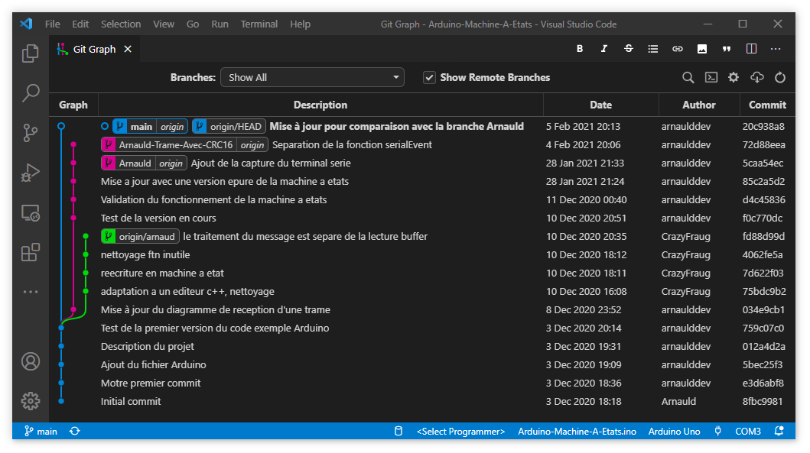

# Arduino-Machine-A-Etats

Ce projet collaboratif a pour but de comprendre le fonctionnement et l'implementation des machines à états pour structurer un programme embarqué.

Nous allons pour cela mettre en oeuvre une partie du [protocol Modbus](https://www.modbustools.com/modbus.html) qui peut être composé soit de données brut "RTU", soit de données textes "ASCII".

[Format de message Modbus ASCII](https://www.virtual-serial-port.org/fr/articles/modbus-ascii-guide/)

Le format des messages Modbus ASCII comprend un caractère de début qui est un deux-points ':' et la fin du message est définie par la combinaison d'un retour à la ligne et d'un saut de ligne (CR LF). Ce type de protocole permet de faire varier le temps de transmission de chaque donnée du message, comme lorsque celui-ci est entrée à la main dans un terminal.

Voici une description complète d'un message Modbus ASCII :

| Start | Address | Function | Data    |   LRC   |  End  |
| :---: | :-----: | :------: | :------ | :-----: | :---: |
|  ':'  | 2 Chars | 2 Chars  | N Chars | 2 Chars | CR LF |

Dans un premier temps, nous allons implémenter une version simple de ce protocol, sans ajouter à la trame l'adresse d'un destinataire, ni la valeur numérique permettant de vérifier l'intégrité des données de la trame. La gestion "Error Checking" du protocole (vérification d'erreur) ne sera donc pas implémentée.

Le but est simplement de pouvoir capturer une trame au format [ASCII](https://en.wikipedia.org/wiki/ASCII) de manière autonome, en créant une machine à états.

| Start | Data    |  End  |
| :---: | :------ | :---: |
|  ':'  | N Chars | CR LF |

Pour la réception de données à travers le port COM principale de la carte Arduino, nous utiliserons la fonction serialEvent() et nous prendrons soin de ne pas écraser un message par un nouveau avant d'avoir pu le lire.

Pour cela vous pouvez vous inspirez du diagramme d'états ci-dessous.

---

## Quelques protocoles de communication que l'on retrouve sur le port série

Les communications séries sont encore aujourd'hui un moyen simple et souple pour mettre de l’intéraction entre la carte Arduino et votre ordinateur, voir d'autres périphériques.

Votre sketch Arduino pourra utiliser le port série pour accéder indirectement (souvent en utilisant un programme sur votre PC développé par exemple en langage [Processing](https://processing.org/) ou en Python) aux ressources de votre ordinateur et ainsi créer de l'interactivité.

Dans l’autre sens, votre ordinateur saura évidement intéragir avec certains capteurs ou périphériques connectés à votre Arduino.

La mise en place de protocoles de communication permettent une transmission de données structurées, cohérentes et vérifiables, car des erreurs de transmission peuvent survenir lors de l'émission, du transport ou de la réception.

Parmi les protocoles de communication citons en quelques uns parmis tant d'autres :

- [Commandes Hayes](https://fr.wikipedia.org/wiki/Commandes_Hayes) ou plus connu sous le nom de commandes AT (utiliser par des composants comme les modules Bluetooth, les GPS ou puces GSM...)
- [MySensors Serial Protocol - 2.x](https://www.mysensors.org/download/serial_api_20)
- [Communication Protocol Best Practices and Patterns](https://arduino.stackexchange.com/questions/4214/communication-protocol-best-practices-and-patterns)
- [voir également le riton-duino.blogspot.com sur les protocoles séries](http://riton-duino.blogspot.com/2019/04/arduino-un-protocole-serie.html)

---

## Terminal ou moniteur série

L'utilisation d'un logiciel coté PC, vous permettra d'écouter et de parler à votre carte Arduino.

Vous pouvez utiliser le **Serial Monitor** de l’IDE Arduino, sinon voici quelques outils disponibles çà et là sur le Web :

* [Docklight](https://docklight.de/)
* [CienTi](https://github.com/CieNTi/serial_port_plotter)
* [CoolTerm](http://freeware.the-meiers.org/)
* [Terminal](https://sites.google.com/site/terminalbpp/)
* [Putty](https://www.chiark.greenend.org.uk/~sgtatham/putty/)
* [Zterm](https://www.dalverson.com/zterm/) pour Mac
* [Moserial](https://wiki.gnome.org/action/show/Apps/Moserial?action=show&redirect=moserial) pour linux
* [et bien d'autre](https://alternativeto.net/software/moserial/?license=free&platform=windows)

Nous vous proposons également de réaliser votre propre terminal série en langage Python, pour cela allez sur la branche [serialevent-string-vers-terminal-python](https://github.com/Artilect-FabTronic/Arduino-Machine-A-Etats/tree/serialevent-string-vers-terminal-python).

---

## Algorithme d'émission/réception d'un message Modbus ASCII


Source : <http://www.ozeki.hu/p_5855-ozeki-modbus-ascii.html>

---

## Test de reception d'une trame

Exemple de messages que doit recevoir le microcontrôleur pour changer l'état de notre LED :

```serial
":LED ON\r\n"
":LED OFF\r\n"
":LED TOGGLE\r\n"
```

Mais si vous essayez d'écrire une commande en minuscule, ça ne fonctionne pas :

":led toggle\r\n"

La raison est que ce qui est transmis du PC au microcontrôleur ne sont que des nombres :

| Numéro TXD  |   1   |   2   |   3   |   4   |   5   |   6   |   7   |   8   |   9   |  10   |  11   |  12   |  13   |
| :---------: | :---: | :---: | :---: | :---: | :---: | :---: | :---: | :---: | :---: | :---: | :---: | :---: | :---: |
|  Type char  |  ':'  |  'L'  |  'E'  |  'D'  |  ' '  |  'T'  |  'O'  |  'G'  |  'G'  |  'L'  |  'E'  | '\r'  | '\n'  |
| Valeur Hexa | 0x3A  | 0x4C  | 0x45  | 0x44  | 0x20  | 0x54  | 0x4F  | 0x47  | 0x47  | 0x4C  | 0x45  | 0x0D  | 0x0A  |

| Numéro TXD  |   1   |   2   |   3   |   4   |   5   |   6   |   7   |   8   |   9   |  10   |  11   |  12   |  13   |
| :---------: | :---: | :---: | :---: | :---: | :---: | :---: | :---: | :---: | :---: | :---: | :---: | :---: | :---: |
|  Type char  |  ':'  |  'l'  |  'e'  |  'd'  |  ' '  |  't'  |  'o'  |  'g'  |  'g'  |  'l'  |  'e'  | '\r'  | '\n'  |
| Valeur Hexa | 0x3A  | 0x6C  | 0x65  | 0x64  | 0x20  | 0x74  | 0x6F  | 0x67  | 0x67  | 0x6C  | 0x65  | 0x0D  | 0x0A  |

On peut remarquer que les caractères en minuscule ont une valeur de codage supérieure de + 0x20 par rapport aux même lettres en majuscule.
Ce codage est défini par [le code ASCII](https://www.commentcamarche.net/contents/93-code-ascii), voir aussi la [table ASCII](https://fr.wikibooks.org/wiki/Les_ASCII_de_0_%C3%A0_127/La_table_ASCII)

---

### Codage réalisé

A partir de l'exemple [Serial Event](https://www.arduino.cc/en/Tutorial/BuiltInExamples/SerialEvent) d'Arduino, nous avons commencé à modifier la manière de recevoir les données pour créer une machine à états.

[Git Graph](https://marketplace.visualstudio.com/items?itemName=mhutchie.git-graph), l'extension pour Visual Studio Code



Les branches de se projet on été renommées :

    Arnauld                  --> serialevent-mae-rx-vers-ab
    Arnauld-Trame-Avec-CRC16 --> serialevent-mae-rx-crc16-vers-ab
    arnaud                   --> serialevent-mae-rx-class-vers-cf
    Terminal.py              --> serialevent-string-vers-terminal-python

---

#### Code de la branche **main**

Utilisation direct de l'exemple [Serial Event](https://www.arduino.cc/en/Tutorial/BuiltInExamples/SerialEvent) d'Arduino avec notament l'utilisation de la [class String](https://www.arduino.cc/reference/en/language/variables/data-types/stringobject/).

---

#### Code de la branche **serialevent-mae-rx-class-vers-cf** de CrazyFraug

Découpage en différentes fonctions et utilisation d'une class, une par action à réaliser.

```cpp
// we implement a state machine, we declare all possible sate values
enum class StateM { idle, received, rx_waiting_end_lf, emission, emission_start, emission_end };
StateM stateOfMachine = StateM::idle;

// the programme will be split in functions, each correspond to a state value
void stateIdle();
void stateReceived();
void stateRXWaitingEndLF(String& amsgModbus);
void stateEmission();
void stateEmissionStart();
void stateEmissionEnd();
```

Le traitement du message est séparé de la lecture buffer.

La machine à états principale pour la reception est dans la fonction :

`void readSerialWithStateMachine(String& amsgModbus)`

---

#### Code de la branche **serialevent-mae-rx-vers-ab** de ArnauldDev

Mise en oeuvre de l'implementation d'une machine à états en utilisant plutot un tableau de char comme buffer de réception.

```cpp
/* Variable globales                                                         */
char g_message_recu[MAX_FRAME_LENGTH]; // buffer qui stocke les caractères ASCII reçu
uint8_t g_compteur_msg_perdu = 0;      // permet de savoir si l'on a loupé la lecture d'un ou plusieurs messages
bool g_nouveau_message_a_lire = false; // si vrai, indique qu'un nouveau message est disponible
```

---

#### Code de la branche **serialevent-mae-rx-crc16-vers-ab** de ArnauldDev

Ajouter le calcul et l'integration du CRC16 pour la reception d'un message.
