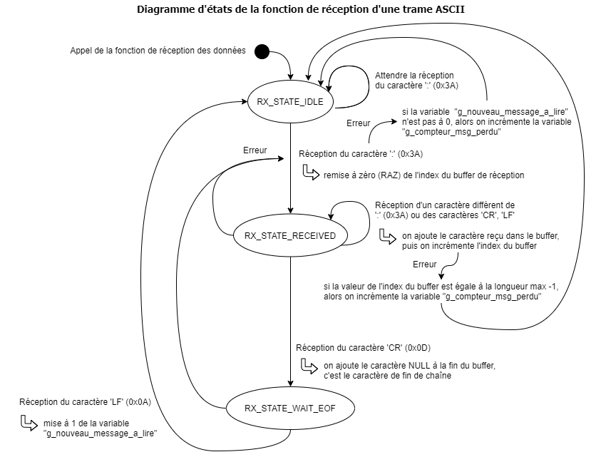
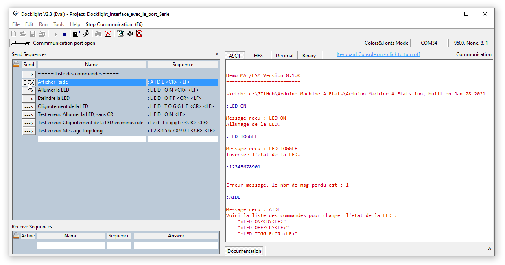

# Arduino-Machine-A-Etats

Ce projet collaboratif a pour but de comprendre le fonctionnement et l'implementation des machines à états pour structurer un programme embarqué.

Nous allons pour cela mettre en oeuvre une partie du [protocol Modbus](https://www.modbustools.com/modbus.html) qui peut être composé soit de données brut "RTU", soit de données textes "ASCII".

[Format de message Modbus ASCII](https://www.virtual-serial-port.org/fr/articles/modbus-ascii-guide/)

Le format des messages Modbus ASCII comprend un caractère de début qui est un deux-points ':' (Start-Of-Frames) et la fin du message est définie par la combinaison d'un retour à la ligne et d'un saut de ligne (CR LF = End-Of-Frame). Ce type de protocole permet de faire varier le temps de transmission de chaque donnée du message, comme lorsque celui-ci est entrée à la main dans un terminal.

Voici une description complète d'un message Modbus ASCII :

| Start | Address | Function | Data    |   LRC   |  End  |
| :---: | :-----: | :------: | :------ | :-----: | :---: |
|  ':'  | 2 Chars | 2 Chars  | N Chars | 2 Chars | CR LF |

Pour aller plus loin, voir "[MODBUS Protocol Specification](https://modbus.org/specs.php)" : [Protocol_V1_1b3](https://modbus.org/docs/Modbus_Application_Protocol_V1_1b3.pdf).

MODBUS utilise une représentation «big-endian» pour les adresses et les éléments de données. Cela signifie que lorsqu'une quantité numérique supérieure à un octet est transmise, l'octet le plus significatif est envoyé en premier.

Donc par exemple, si la taille occupé par une valeur est de 16 bits comme **`0x1234`**, le premier octet envoyé est **`0x12`** puis l'octet suivant sera **`0x34`**.

Voir également la description d'une trame ([page 12](https://modbus.org/docs/Modbus_over_serial_line_V1_02.pdf)) et [Big Endian and Little Endian](https://www.techno-science.net/definition/240.html) ([Coding](https://www.irif.fr/~carton/Enseignement/Architecture/Cours/Coding/index.html)).

## Mise en oeuvre d'un protocol de communication

Dans un premier temps, nous allons implémenter une version simple de ce protocol, sans ajouter à la trame l'adresse d'un destinataire, ni la valeur numérique permettant de vérifier l'intégrité des données de la trame. La gestion "Error Checking" du protocole (vérification d'erreur) ne sera donc pas implémentée.

Le but est simplement de pouvoir capturer une trame au format [ASCII](https://en.wikipedia.org/wiki/ASCII) de manière autonome, en créant une machine à états.

Après détection de la fin de la trame, nous rajoutons à notre protocol maison le calcul et la vérification d'un CRC16.
Ce champ de vérification des erreurs basé sur une méthode de vérification de redondance cyclique (CRC), est appliquée au contenu du message.
Par exemple si vous avez une valeur de CRC16 de 0x1234, voici comment ils seront intégrés à notre trame en convertissant chacun des digits en valeur ASCII :

| Start     | Data     |     CRC16       |    End    |
| :-------: | :------- | :-------------: | :-------: |
|  1 octet  | N octets | 4 octets        | 2 octets  |
|    ':'    | N Chars  | '1' '2' '3' '4' | CR LF     |

Pour la réception de données à travers le port COM principale de la carte Arduino, nous utiliserons la fonction serialEvent() et nous prendrons soin de ne pas écraser un message par un nouveau avant d'avoir pu le lire.

Pour cela vous pouvez vous inspirez du diagramme d'états ci-dessous.

---

## Algorithme d'émission/réception d'un message Modbus ASCII


Source : <http://www.ozeki.hu/p_5855-ozeki-modbus-ascii.html>

---

## Test de reception d'une trame

Exemple de messages que doit recevoir le microcontrôleur pour changer l'état de notre LED :

```serial
":LED ON\r\n"
":LED OFF\r\n"
":LED TOGGLE\r\n"
```

Mais si vous essayez d'écrire une commande en minuscule, ça ne fonctionne pas :

":led toggle\r\n"

La raison est que ce qui est transmis du PC au microcontrôleur ne sont que des nombres :

| Numéro TXD  |   1   |   2   |   3   |   4   |   5   |   6   |   7   |   8   |   9   |  10   |  11   |  12   |  13   |
| :---------: | :---: | :---: | :---: | :---: | :---: | :---: | :---: | :---: | :---: | :---: | :---: | :---: | :---: |
|  Type char  |  ':'  |  'L'  |  'E'  |  'D'  |  ' '  |  'T'  |  'O'  |  'G'  |  'G'  |  'L'  |  'E'  | '\r'  | '\n'  |
| Valeur Hexa | 0x3A  | 0x4C  | 0x45  | 0x44  | 0x20  | 0x54  | 0x4F  | 0x47  | 0x47  | 0x4C  | 0x45  | 0x0D  | 0x0A  |

| Numéro TXD  |   1   |   2   |   3   |   4   |   5   |   6   |   7   |   8   |   9   |  10   |  11   |  12   |  13   |
| :---------: | :---: | :---: | :---: | :---: | :---: | :---: | :---: | :---: | :---: | :---: | :---: | :---: | :---: |
|  Type char  |  ':'  |  'l'  |  'e'  |  'd'  |  ' '  |  't'  |  'o'  |  'g'  |  'g'  |  'l'  |  'e'  | '\r'  | '\n'  |
| Valeur Hexa | 0x3A  | 0x6C  | 0x65  | 0x64  | 0x20  | 0x74  | 0x6F  | 0x67  | 0x67  | 0x6C  | 0x65  | 0x0D  | 0x0A  |

On peut remarquer que les caractères en minuscule ont une valeur de codage supérieure de + 0x20 par rapport aux même lettres en majuscule.
Ce codage est défini par [le code ASCII](https://www.commentcamarche.net/contents/93-code-ascii), voir aussi la [table ASCII](https://fr.wikibooks.org/wiki/Les_ASCII_de_0_%C3%A0_127/La_table_ASCII)

---

### Codage réalisé

A partir de l'exemple [Serial Event](https://www.arduino.cc/en/Tutorial/BuiltInExamples/SerialEvent) d'Arduino, nous avons modifier la manière de recevoir les données pour créer une machine à états comme celle-ci :



---

### Test du programme Arduino avec Docklight

[Docklight](https://docklight.de/) est un logiciel de terminal série :


