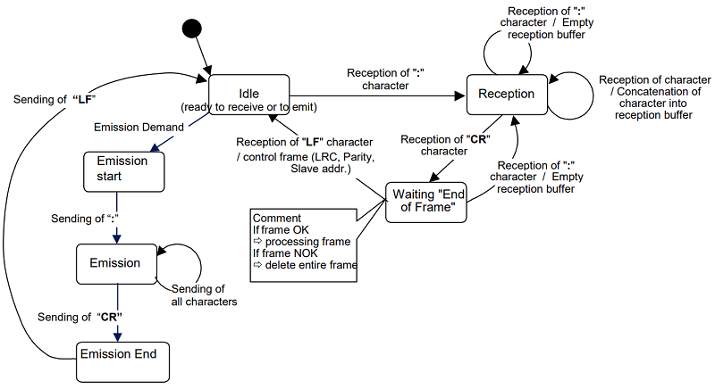

# Arduino-Machine-A-Etats

Ce projet collaboratif, va mettre en oeuvre le [protocol Modbus](https://www.modbustools.com/modbus.html) qui peut être soit en données brut "RTU", soit en mode texte "ASCII".

Mise en oeuvre de la fonction serialEvent() pour la réception d'une trame Modbus ASCII.

[Format de message Modbus ASCII](https://www.virtual-serial-port.org/fr/articles/modbus-ascii-guide/)

Le format des messages Modbus ASCII comprend un caractère de début qui est un deux-points ':' et la fin du message est définie par un retour à la ligne et un saut de ligne. Cela permet de faire varier l’espace entre les messages et d’adapter Modbus ASCII à la transmission via certains modems.

Le but est de pouvoir capturer une trame au format [ASCII](https://en.wikipedia.org/wiki/ASCII) de manière autonome, en créant une machine à états tel que ci-dessous.

---

## Algorithme d'émission/réception d'un message Modbus ASCII

Source : <http://www.ozeki.hu/p_5855-ozeki-modbus-ascii.html>

---

## Test de reception d'une trame

Exemple de message à recevoir pour changer l'état d'une LED de D0 à D5 :

":LED2ON\r\n"

### Codage à réaliser

A partir de l'exemple [Serial Event](https://www.arduino.cc/en/Tutorial/BuiltInExamples/SerialEvent) d'Arduino, nous allons modifier la manière de recevoir les données pour créer une machine à états.
